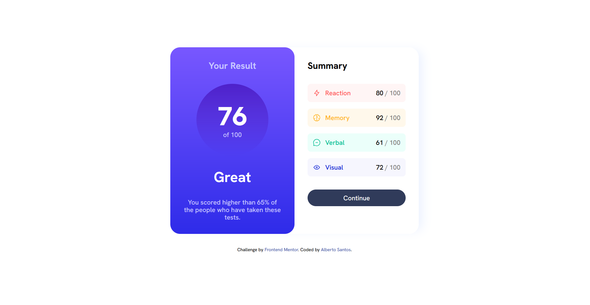
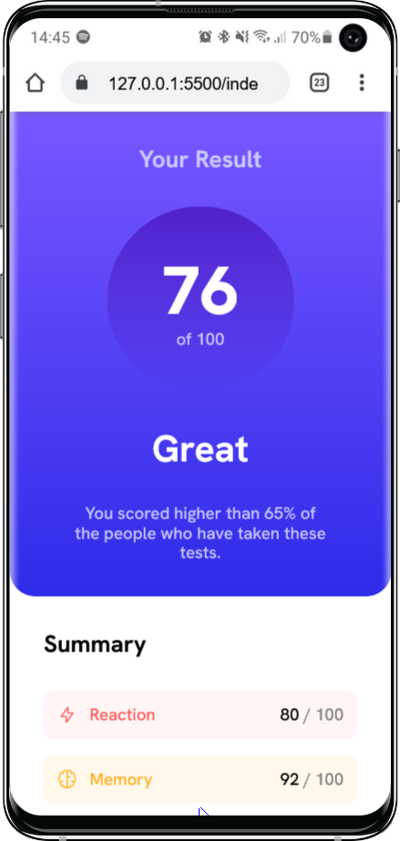
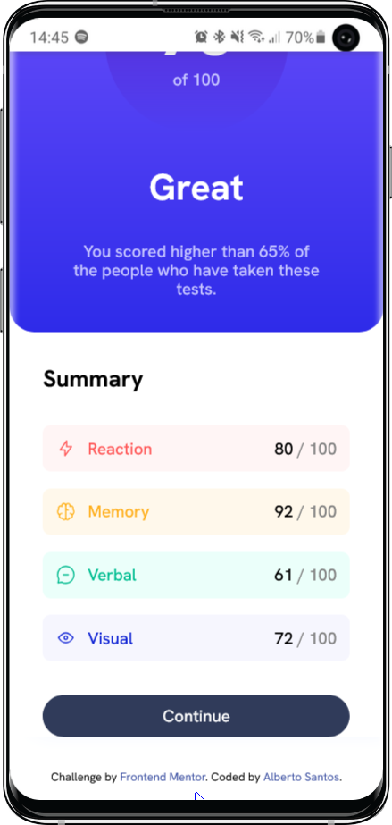

# Frontend Mentor - Solución de componente de código QR

Esta es una solución al desafío del componente Resumen de resultados en Frontend Mentor (https://www.frontendmentor.io/challenges/results-summary-component-CE_K6s0maV). Los desafíos de Frontend Mentor te ayudan a mejorar tus habilidades de codificación mediante la creación de proyectos realistas.
## Tabla de contenidos

- [Descripción general](#descripción-general)
	- [Captura de pantalla](#captura-de-pantalla)
	- [Enlaces](#enlaces)
- [Mi proceso](#mi-proceso)
	- [Creado con](#creado-con)
	- [Lo que aprendí](#lo-que-aprendí)

- [Autor](#autor)


**Nota: elimine esta nota y actualice la tabla de contenidos en función de las secciones que conserve.**

## Descripción general
Creación de una tarjeta-resumen para los resultados de un test

### Captura de pantalla

 
-




### Enlaces

- URL de la solución: [Github](https://github.com/AlbertGit8/ResultsSummaryComponent)
- URL del sitio en vivo: [Natlify](https://resultsummary-albertosantos.netlify.app/)

## Mi proceso
Lo primero es crear un package.json, para ello mediante npm init lo creamos, instalamos sass como depencia de desarrollo con npm i --save-dev sass, para compilar sass, en el package.json en la seccion de scripts creamos uno para sass con la direccion donde queremos que sass compile los archivos, carpeta que llamaremos build, compilamos los archivos con npm run sass. 
Para no tener que estar ejecutando el comando constantemente cada vez que queramos reflejar cambios habilitamos el modo watch a sass. Además instalamos gulp para automatizar tareas. Hay que configurar un gulpfile.js, toda la info está reflejada en el propio gulpfile.js. Aunque es un proyecto pequeño, he añadido sass para familiarizarme con la tecnología y optimizar la estructura de proyectos futuros.

Lo primero es estructurar el html, cosa que al principio no hice correctamente porque al hacer el diseño tuve que modificar algunas cosas.

Una vez estructurado pasamos al diseño, hecho en SASS como bien se ha mencionado anteriormente, esto me permite estructurar mucho mejor cada parte del proyecto a nivel de diseño.

Lo último que hice fue añadir unos mixins para hacer el proyecto responsive entre un modelo mobile y desktop.

### Creado con

- Marcado HTML5 semántico
- Propiedades personalizadas de CSS
- Flexbox
- Flujo de trabajo para dispositivos móviles
- [SASS](https://sass-lang.com/) - SASS extensión de CSS


### Lo que aprendí

He aprendido como configurar un archivo de gulp, he recordado conceptos de sass, he aprendido lo que es hsl y hsla, aqui una breve explicaion:
#### hsl
- Hue (Matiz)

	- El primer valor en hsl representa el matiz, es decir, el color básico. Va de 0 a 360 y es un ángulo en la rueda de colores:
		- 0°: Rojo
		- 120°: Verde
		- 240°: Azul
        Entre estos valores, hay colores intermedios (como naranja, amarillo, púrpura, etc.).

- Saturation (Saturación)

	- El segundo valor representa la saturación, que determina la intensidad o pureza del color. Va de 0% a 100%:
		- 0%: Sin color, es decir, un tono gris.
		- 100%: El color más intenso y puro.

- Lightness (Luminosidad)

	- El tercer valor es la luminosidad, que controla cuán claro u oscuro es el color.
	- También va de 0% a 100%:
		- 0%: Totalmente negro.
        - 50%: El color normal.
        - 100%: Totalmente blanco.

```css
color: hsl(256, 72%, 46%); /* Color púrpura, con saturación media-alta y luminosidad media */
```

#### hsla
hsla es una extensión de hsl, que añade un cuarto valor: Alpha (opacidad). Este cuarto valor permite controlar la transparencia del color.

- Alpha (Opacidad)

    - El cuarto valor en hsla es la opacidad, que controla cuán transparente es el color.
    - Va de 0 a 1:
        - 0: Totalmente transparente.
        - 1: Totalmente opaco.

```css
color: hsla(256, 72%, 46%, 1); /* Púrpura opaco (1 significa que no es transparente) */
color: hsla(256, 72%, 46%, 0.5); /* Púrpura semi-transparente (50% de opacidad) */

```


## Autor
- Instagram: [@albertosdz](https://www.instagram.com/albertosdz)

